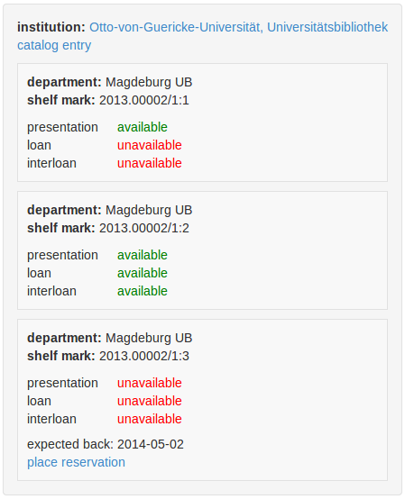
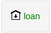

# Introduction

The demand to open up library systems through web services has been known for
years [@Breeding2009]. In particular, service-oriented architecture (SOA)
promised to better allow a continuous evolution of library automation and to
better connect with external systems. Nevertheless current library systems are
rarely built of loosely coupled parts that could be used independently.
The background of this abidance on monolithical systems is to be discussed
elsewhere, but one reason might be a lack of motivation to provide library
services via open APIs.

## Library services and APIs

Services provided by a library or similar institution should be easy-to-use for
anyone and in any form. Most services, however, can only be used in the fixed
context of a particular user interface. If a service can be accessed via
application programming interface (API), it can also be integrated and used
in other applications. Nevertheless there is a lack of motivation to expose
services via open APIs.

User interfaces (UIs) are curated and revised by usability studies
and user experience (UX) at best. In other instances the UI is simply judged
with common sense by normal library staff and management. APIs on the other hand, cannot simply be viewed,
used, and judged by anyone. Unlike the UI, an API is not a final application to
make use of a service, but the basis for creation of service applications:
Without APIs, applications are difficult to build and services can only be
provided in limited form. Without applications, however, it is difficult to
justify the need for an API.

To give an example, most library systems lack an API to query current
availability of documents held by the library. As long as information about
current availability was only displayed in local library OPACs there was little
motivation to create a public API for this purpose. With the need to display
availability information in discovery interfaces such as VuFind, the Document
Availability Information API ([DAIA]) was specified and implemented at GBV
[@DAIA]. But little interest was shown by other libraries and system vendors as
long as they did not require the API for internal use. The full benefit of an
open API is not revealed until different applications by different parties make
use of it. This article will demonstrate a possible strategy to increase
visibility and use of library APIs by providing client modules that facilitate
the creation of applications by third parties.^[This article is based on the
assumption that libraries actually want to facilitate the use of their servics.
In some cases this assumption might be wrong.] The modules are based on the
JavaScript framework AngularJS which is getting more and more popular among
developers of web applications. The general strategy is illustrated in the
following diagram:


# AngularJS

[AngularJS] is a web application framework that aims to enhance the
functionality of JavaScript. The framework is designed to support
modularization on multiple levels. Functionality of applications is broken into
parts that can be tested and reused independently. 

Application logic is first grouped in *modules*, each included with an HTML
`<script>` tag. Some popular modules are listed at the inofficial directory
<http://ngmodules.org/>. Modules may build on each other and define
*directives*. These directives can be used in form of custom HTML tags and
attributes ("declarative HTML"). The core AngularJS module contains directives
for basic programming syntax in HTML, such as conditionals (`ng-if`) and loops
(`ng-repeat`), among others. This extension of HTML is further enriched by a
template syntax with AngularJS *expressions* written in curly brackets
(`{{...}}`). The most common use of these expression is to dynamically display
variables in HTML templates. In contrast to most other template systems,
variables are bound two-way: the display is updated automatically when a
variable is changed, and changes of the HTML document (e.g. by input forms) are
reflected in the JavaScript variables. As well, as a result of the modularization, variables are
limited to *scopes* that act like namespaces in other programming languages.

The following example illustrates the use of AngularJS with scope variables,
templates, and directives:^[All examples are available also as part of the
article's code repository at <https://github.com/jakobib/angularjs2014/>.]

```{.html}
<html ng-app="myApp">
 <head>
  <script src="angular.min.js"></script>
  <script>
    angular.module('myApp', []);
    function MyController($scope) {
      $scope.books = [
        { title: "One Thousand and One Nights" },
        { title: "Where the Wild Things Are", author: "Sendak" },
        { title: "The Hobbit", author: "Tolkien" },
      ];
    }
  </script>
 </head>
 <body ng-controller="MyController">
  <ul ng-repeat="b in books | orderBy:'title'">
   <li>
    <i>{{b.title}}</i>
    <span ng-if="b.author">by {{b.author}}</span>
   </li>
  </ul>
 </body>
</html>
```

The example consists of an application module "myApp". This module defines a
controller "MyController" to set a list of three bibliographic items in the
variable "books" of a given scope. The controller is later used in the HTML
body to display a sorted list of books with an HTML template. The template
makes use of standard AngularJS directives (`ng-repeat`, `ng-if`) and
expressions (`| orderBy:'title'`, `b.title`, `b.author`). The application logic
to create such a list could also be packed in a new directive to be used as
"widget" at multiple places.

# Modules for embedding library services

The practical embedding of library services in websites with AngularJS is
illustrated in the following with two examples. Both are available as AngularJS
modules for easy reuse: the *ng-suggest* module provides access to search 
suggestions and links [@ngsuggest] and the *ng-daia* module provides access to
availability information [@ngdaia]. Both modules are hosted at public git 
repositories with API documentation, examples, and downloads 
(<https://gbv.github.io/ng-suggest/> and <https://gbv.github.io/ng-daia/>).

## Suggestions with ng-suggest

The OpenSearch standard for search engines includes a specification for how to 
query search suggestions and autocomplete services via HTTP [@Clinton2006].
Suggestion services are provided by many search applications as "typeahead".
The method can also be used for instance by recommendation services [@Voss2008] 
and to support tagging with controlled vocabularies [@Nagaya2011].


The OpenSearch Suggestions specification defines a query response as JSON array
with at least two elements (query string and a list of search completions):

    [
        "Moz",
        ["mozilla","mozilla firefox","mozart","mozilla thunderbird",...]
    ]

Optional elements can include descriptions and URLs for each search completion.
While processing of this simple format is not very complex, it still requires
JavaScript skills to make use of a suggestion service. *ng-suggest* simplifies
the embedding to two HTML statements. The following example code adds Wikipedia 
typeahead features to an input form element:

```{.html}
<html ng-app="myApp">
 <head>
  <script src="angular.min.js"></script>
  <script src="ui-bootstrap-tpls.min.js"></script>
  <script src="ng-suggest.min.js"></script>
  <script>
    angular.module('myApp', ['ui.bootstrap','ngSuggest']);
    function MyController($scope) {
      $scope.api = "https://en.wikipedia.org/w/api.php?action=opensearch"
                 + "&limit=10&namespace=0&format=json&search=";
      $scope.selectItem = function(item) {
        $scope.item = item;
      };
    };
  </script>
  <link href="bootstrap.min.css" rel="stylesheet" />
 </head>
 <body ng-controller="MyController">
  <input style="width:400px" class="form-control"
         typeahead-on-select="selectItem($item)"
         ng-model="input"
         suggest-typeahead="api" jsonp=1
         placeholder="Search Wikipedia" />
  <div ng-if="item">{{item.label}}</div>
 </body>
</html>
```

The resulting HTML page would look like this:


Similar suggestions can be provided for any Open Search Suggestions service
by just changing the service's base URL. Among other features, responses can be
embedded as simple lists (SeeAlso recommender services, for instance related 
documents and related publications), and different JSON response formats can 
be mapped from.

## Availability with ng-daia

DAIA defines a data model and an HTTP API for accessing information about the
current availability of documents. Its aim is to provide a way for libraries to
allow open and easy-to-use access to holding information from their catalogs.
This, in turn, enables the inclusion of document availability information in
external applications and websites (catalogs, reference management, e-learning
platforms etc.). Among other formats, DAIA provides availability information in JSON, the first choice for web applications written
in JavaScript. The AngularJS module *ng-daia* implements client code to execute
and process a DAIA query and to display holding information in convenient form.
The integration into HTML is exemplarily documented in the following code: 

```{.html}
<html ng-app="myApp">
 <head>
  <script src="angular.min.js"></script>
  <script src="ng-daia.min.js"></script>
  <script>angular.module('myApp', ['ngDAIA']);</script>
  <link href="ng-daia.css" rel="stylesheet" />
 </head>
 <body>
  <div daia-api="http://daia.gbv.de/" 
       daia-id="opac-de-ma9:ppn:685460711">
  </div>
 </body>
</html>
```

The *ng-daia* module provides a directive (`daia-api`) to query a DAIA service
with a given document identifier (`daia-id`). The recieved DAIA response is then
fed to a customizable AngularJS template, resulting in the following display: 



The full availability view as implemented in the default templates of *ng-daia*
reflects the nested structure of DAIA data model, consisting of an outer layer
for institutional and general document information and displays for particular
document holdings [@DAIA]. The default template of directive `ng-api` uses
another directive for display of holding item (`daia-item`) and its item 
template can be customized as well. Another directive is provided for most
compact display (`daia-simple`, see figure 5). DAIA Simple is a flattened,
aggregated form of availability information that covers typical use cases,
such as short display in a result list [@DAIA, section 6.1]. The *ng-daia* 
module includes functions to transform from full DAIA to DAIA simple as well.



All templates included in *ng-daia* can be customized with CSS. Localization 
for display in other languages is already supported with the popular module 
[angular-translate] [@angular-translate]. Thanks to two-way binding of 
AngularJS variables, a simple statement such as `$scope.language = 'de'` can
be enough to update the full availability display in another language.

# Conclusions

Despite efforts to open up library systems via standard APIs, for instance the
ILS-DI recommendations [@ilsdi], the support of library services via open APIs
is rather low. If APIs exist (e.g. NCIP), they are often complex,
vendor-specific, or available only for internal use. One reason for the lack of
open APIs may be the invisibility of benefits and usage examples. The examples
given in this article demonstrate how library services (e.g. search
suggestions, recommendations, document availability...) can be used easily
once they have been made available via standardized APIs (e.g. Open Search
Suggestions and DAIA). 

The simple integration into web applications also requires client modules like
*ng-suggest* and *ng-daia* for AngularJS.  Modules for other standard APIs
relevant to libraries, such as OpenSearch and SRU for search [@Hammond2010] and
PAIA for patron account interaction [@PAIA], shouldn't be hard to
implement.^[We are currently working on the module *ng-skos*
(<https://github.com/gbv/ng-skos>) to interact with authority files and simple
knowledge organisation systems.] Most importantly, these client modules only
have to be implemented once instead of having to build both server and client
implementation for each particular library system. With a set of AngularJS
modules for the basic library services (search, availability, patron account)
it should even be possible to create a custom OPAC interface in less than
hundred lines of HTML and JavaScript.

Even if AngularJS is not the framework of your choice, it makes sense to
provide client modules to your APIs, as illustrated in figure 1. Libraries
should not only expose their services via openly specified APIs but also
provide client libraries to facilitate the integration of these services into
web applications. To minimize the work of doing so, one should build on
standardized APIs independent from particular library systems. We hope to
motivate more library developers in doing so.^[One can also ask the vendor of
library systems to implement standardized APIs to the core functionality of its
product, but this requires some pressure by libraries as customers.]

[DAIA]: http://purl.org/NET/DAIA
[AngularJS]: https://angularjs.org/
[angular-translate]: https://angular-translate.github.io/

# References

---
nocite: '@ngmodules'
...

